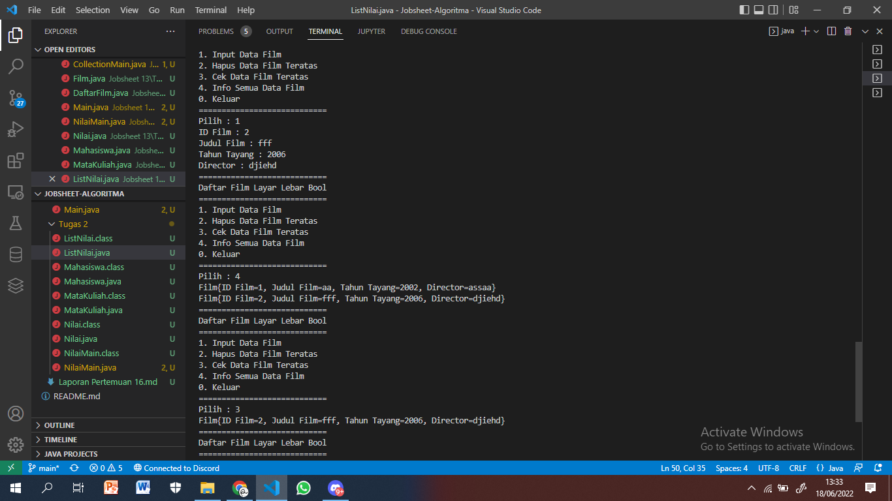
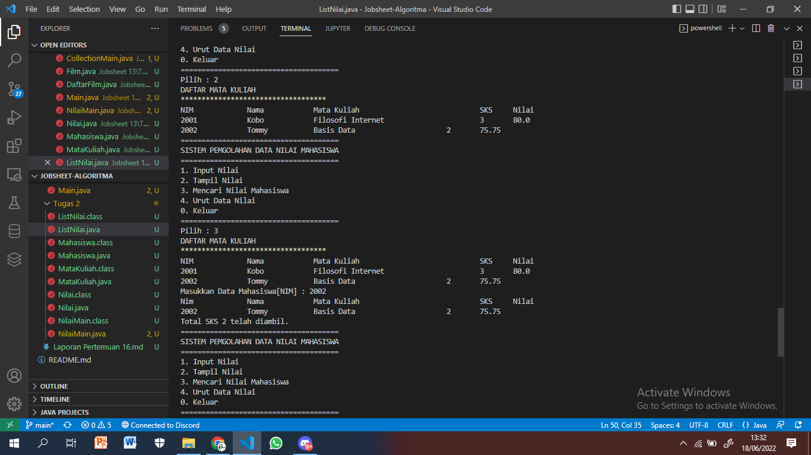

###### Nama : Roziq Mahbubi
###### Kelas : 1G TI
###### NIM : 2141720086

### Jobsheet 13 Java Collection

#### 16.2.3
1. > Karena pada saat deklarasi ArrayList tidak disebutkan tipe data spesifik

2. 
```java
    List<Integer> l = new ArrayList<>();
    l.add(1);
    l.add(2);
    l.add(3);
    l.add(4);
```

3. 

4. 

5. > fungsi "push" berfungsi untuk menambahkan elemen pada posisi terdepan

#### 16.3.3
1. > fungsi add akan menambahkan elemen pada bagian paling belakang, sedangkan fungsi push akan menambahkan elemen di posisi terdepan.

2. > Stack tidak akan terisi elemen baru, karena semua elemen stack baru saja dihapus dengan fungsi pop

3. > Baris kode tersebut akan melakukan print elemen stack dengan menggunakan format dan memanfaatkan syntax foreach untuk melakukan perulangan

4. > Akan terjadi error, karena yang dapat dijadikan object adalah percabangan dari List, bukan List itu sendiri.

5. 

6. 

#### 16.4.3
1. > Konsep yang digunakan adalah penggunaan parameter array yang panjangnya akan mengikuti banyaknya nilai parameter yang dimasukkan, kelebihannya adalah fleksibilitas penambahan elemen jika tidak diketahui dengan pasti berapa banyak elemen yang harus ditambahkan

2. 

3. 

#### 16.5
> Nomor 1


> Nomor 2

