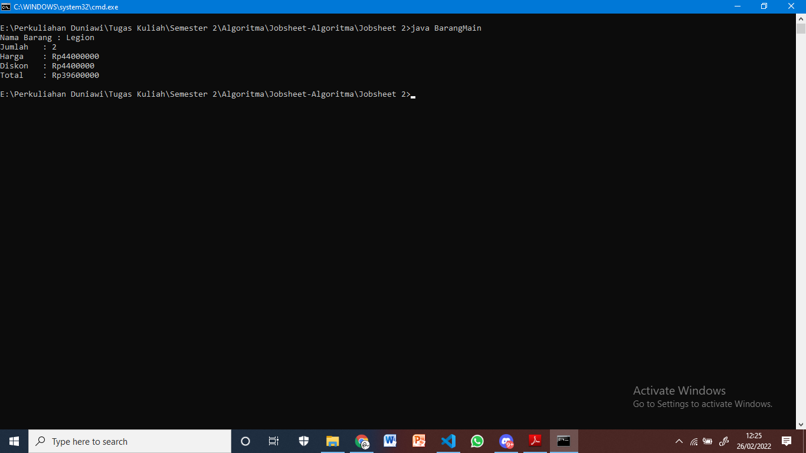
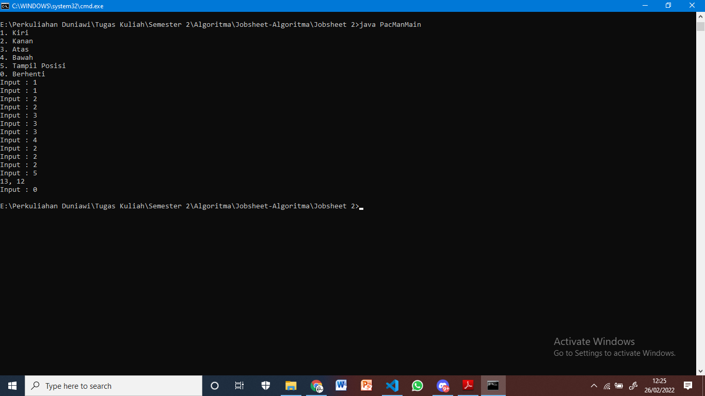

#Laporan Jobsheet Pertemuan 2

Nama : Roziq Mahbubi
Kelas : 1G TI
NIM : 2141720086
##Jawaban Pertanyaan :
###Subbab 2.2
1. Karakteristik Class : Class merupakan suatu rancangan yang tidak memiliki bentuk nyata dan atribut pada class bersifat umum dan tidak memiliki nilai spesifik.
Karakteristik Object : Object merupakan bentuk nyata dari class dan atribut dari object bersifat spesifik dan memiliki nilai yang spesifik.
2. Class (diikuti nama class)
3. Class tersebut memiliki 4 atribut, atribut namaBarang dan jenisBarang dideklarasikan pada baris 13. Sedangkan atribut stok dan hargaSatuan dideklarasikan pada baris 14.
4. Class tersebut memiliki 4 method, yang masing-masing dideklarasikan pada baris 16 untuk method tampilBarang, 23 untuk method tambahStok, 27 untuk method kurangiStok, dan 31 untuk method hitungHargaTotal.
5. void kurangiStok(int n){
    if(stok>0){
        stok -= n;
    }else{
        sout("Stok kosong!");
    }
}
6. Untuk mempersingkat proses sehingga pengguna tidak perlu memasukkan nilai sebelum proses dimulai.
7. Karena method tersebut dimaksudkan untuk memberikan nilai akhir dari proses didalamnya.
8. Karena dalam method tersebut proses yang dilakukan hanya dimaksudkan untuk merubah nilai dari atribut saja.

###Subbab 2.3
1. Instansiasi class dilakukan pada baris 15 dengan nama "b1".
2. Kata kunci : "nama object"."nama atribut/method"

###Subbab 2.4
1. Deklarasi konstruktor berparameter dilakukan pada baris 18.
2. Pada baris program tersebut dilakukan instansiasi object dari class "Barang" dengan konstruktor yang memiliki parameter dan nilai didalam tanda kurung adalah nilai-nilai yang ditujukan untuk mengisi parameter pada konstruktor calss "Barang".
3. Barang b3 = new Barang("Legion", "Laptop", 69, 22000000);

##Latihan :
###Subbab 2.5 
1. Barang : 

2. Pacman :
