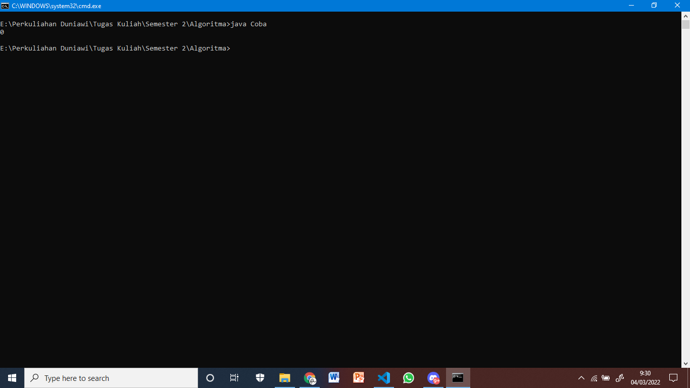
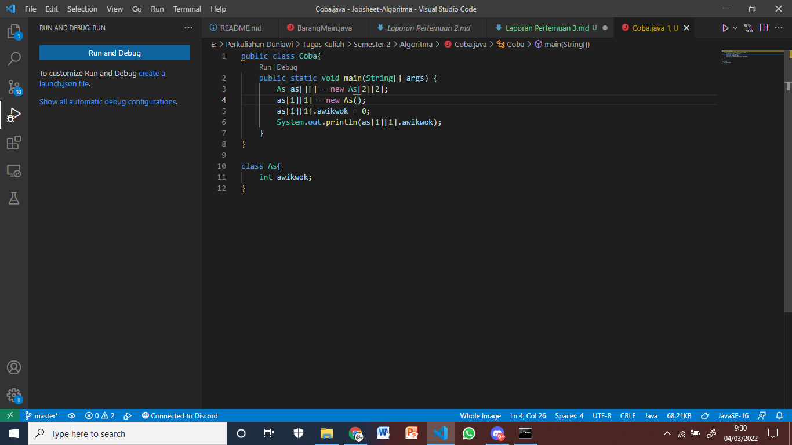
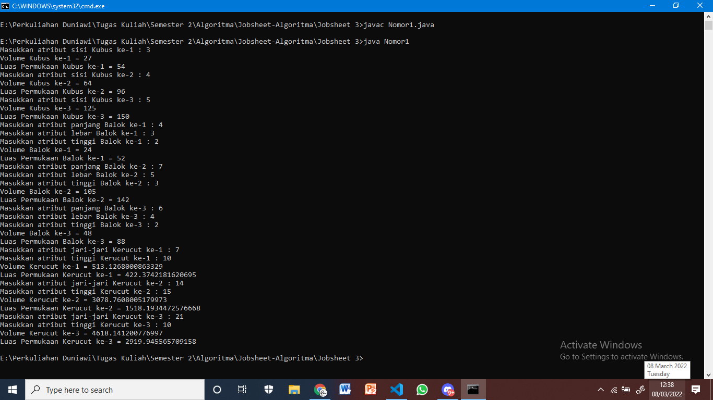
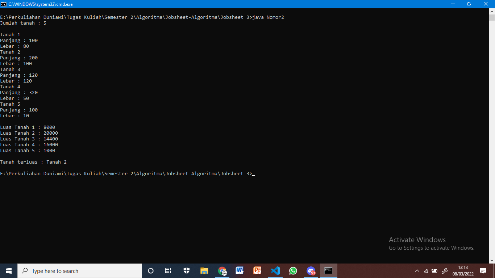
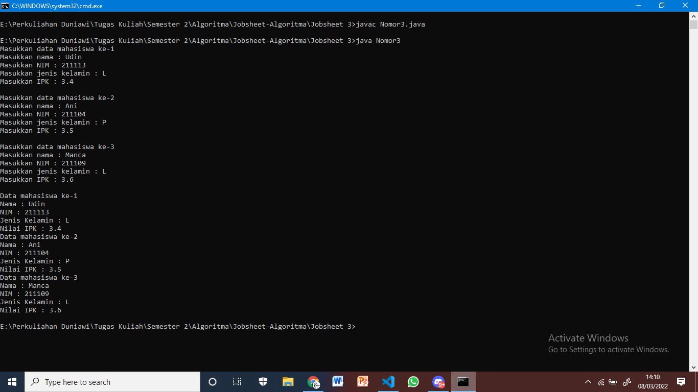

#Laporan Jobsheet Pertemuan 3

Nama : Roziq Mahbubi
Kelas : 1G TI
NIM : 2141720086
##Jawaban Pertanyaan :
###Subbab 3.2 :
1. Untuk class yang akan dibuat array of object wajib memiliki setidaknya satu atribut dan tidak wajib untuk memiliki method, karena array of object yang tidak memiliki satupun atribut tidak memiliki kegunaan.
2. Tidak, class tersebut tidak memiliki konstruktor. Pemanggilan konstruktor tersebut merupakan bentuk default yang dilakukan baik saat ada konstruktor maupun tidak.
3. Baris kode tersebut dimaksudkan untuk deklarasi array of object dari sebuah class.
4. Baris kode tersebut digunakan untuk instansiasi array of object menjadi object dan mengisi nilai dari atribut object.
5. Hal itu dimaksudkan untuk memudahkan saja.

###Subbab 3.3 : 
1. Ya, array of object dapat diimplementasikan ke dalam array 2 dimensi.
2. 
    
3. Karena ppArray indeks 5 belum diinstansiasi sebelum diakses.
4. system.out.print("Masukkan panjang array of object yang diinginkan : ");
int p = sc.nextInt();
PersegiPanjang ppArray[] = new PersegiPanjang[p];
5. Tidak apa-apa, karena instansiasi ulang hanya akan mereset nilai yang telah diisikan pada atribut object.

###Subbab 3.4
1. Bisa, contoh :
class Pulpen{
    int panjang;
    double ketebalanTinta;
    String warna;

    Pulpen(){
    }
    Pulpen(int a, String b){
        panjang = a;
        warna = b;
    }
    Pulpen(int p, double t, String w){
        panjang = p;
        ketebalanTinta = t;
        warna = w;
    }
}
2. public class Segitiga{
    public int alas, tinggi;
    Segitiga(int a, int t){
        alas = a;
        tinggi = t;
    }
}
3. public class Segitiga{
    public int alas, tinggi;

    Segitiga(int a, int t){
        alas = a;
        tinggi = t;
    }

    int hitungLuas(){
        return a*t/2;
    }

    int hitungKeliling(){
        return a+t+(Math.sqrt((a*a)+(t*t)));
    }
}
4. public class SegitigaMain{
    Segitiga sgArray[] = new Segitiga[4];
    sgArray[0] = new Segitiga(10, 4);
    sgArray[1] = new Segitiga(20, 10);
    sgArray[2] = new Segitiga(15, 6);
    sgArray[3] = new Segitiga(25, 10);
}
5. for(int i=0; i<sgArray.length; i++ ){
    System.out.println("Luas Segitiga ke-" + (i+1) + " : " + sgArray[i].hitungLuas);
    System.out.println("Keliling Segitiga ke-" + (i+1) + " : " + sgArray[i].hitungKeliling);
}

##Latihan Praktikum
1.
2.
3.