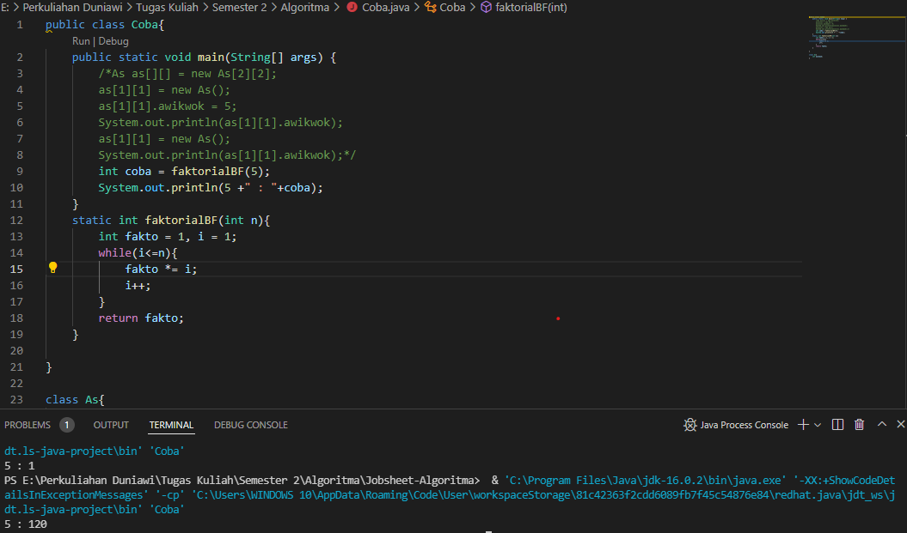
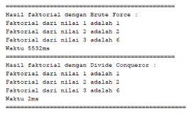
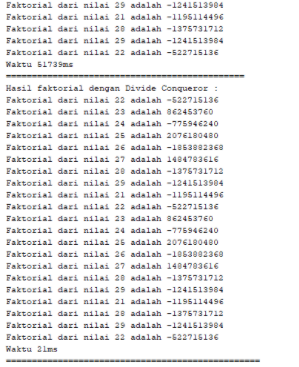
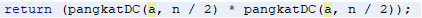
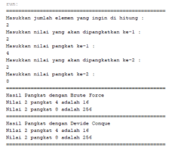
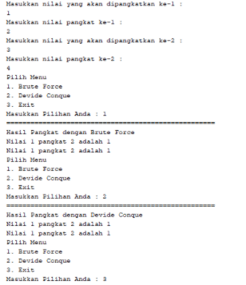
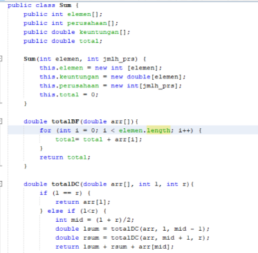
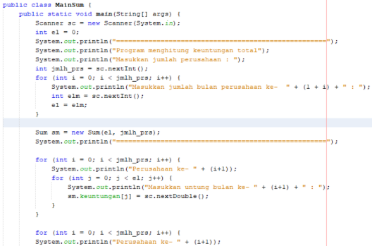
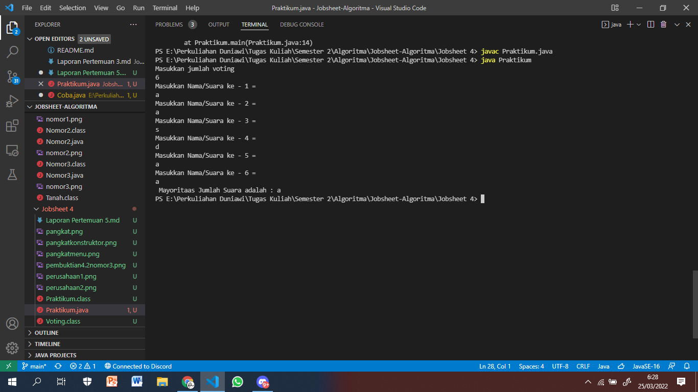

# Laporan Jobsheet Pertemuan 5

Nama : Roziq Mahbubi
Kelas : 1G TI
NIM : 2141720086
## Jawaban Pertanyaan :
### Subbab 4.2
1. Base line pada algoritma divide and conquer tersebut dimaksudkan ketika n bernilai 1, maka nilai return juga bernilai satu. Karena operasi faktorial adalah operasi perkalian dari angka 1 sampai angka yang diinputkan oleh user, sehingga base line yang digunakan sebagai batas rekursif adalah ketika nilai variabel bernilai 1.
2. Ya, implementasi Algoritma Divide and Conquer Faktorial tersebut telah melakukan 3 tahapan divide, conquer dan combine. Pada baris kode if else dilakukan tahap divide dimana jika inputan tidak bernilai 1, maka akan dilakukan proses rekursif dimana pada proses tersebut ada baris kode yang akan melakukan pengalian nilai yang dijadikan parameter, kemudian parameter berikutnya dihasilkan dari pengurangan pada inputan user yang dilakukan secara berulang hingga mencapai base line. Dan ketika proses mencapai base line, akan terjadi tahap conquer yang disertai dengan tahap combine secara bertahap dengan mengalikan hasil dari base line dengan nilai pengurangan sebelumnya.
3. Bisa, karena perintah perulangan bukan hanya perintah for, perulangan juga bisa dilakukan dengan perintah while dan do while

4. 
5. 

### Subbab 4.3
1. Perbedaan dari method PangkatBF() dan PangkatDC yakni pada method pangkatBF() menggunakan fungsi iterative, sedangkan pada method pangkatDC() menggunakan fungsi rekursif.
2. Maksud dari potongan tersebut yakni apabila terdapat suatu bilangan ganjil maka program akan melakukan pembagian terhadap variuable n, yakni dibagi 2 kemudian dikalikan dengan method itu sendiri dan kemudian di kalikan lagi dengan variable a.Namun apabila terdapat suatu bilangan genap maka program akan melakukan return/nilai balik dan di dalam return tersebut dilakukan pembagian terhadap variable n, yang mana variable n di bagi 2 dan kemudian di kalikan dengan method itu sendiri namun tidak dikalikan dengan nilai daripada variable a.
3. Tahap combine sudah terjadi pada kode tersebut, dan lebih tepatnya tahapan tersebut di lakukan pada class Pangkat
* Contoh : 
4. 
5. 

### Subbab 4.4
1. 
* Perbedaan perhitungan yang terjadi pada method TotalBF() yakni, kode program terkesan lebih ringkas dan sederhana.
* Perbedaan perhitungan yang terjadi pada method TotalDC() yakni, kode program lebih panjang daripada kode program pada method TotalBF(),namun method ini memiliki keuntungan yang mana pada method ini kita dapat memecahkan masalah.
2. Dengan cara mengganti syntax println menjadi syntax printf dan juga teknik pembatasan karakter.
3. Return value tersebut berguna untuk mengembalikan nilai dari variable lsum,variable rsum dan juga arr [mid] yang mana masing-masing nya di jumlah kan terlebih dahulu.
4. Di butuhkan variable mid pada method TotalDC() yakni guna menampng nilai dari perhitungan (1+r)/2 yang mana nantinya akan gi gunakan sebagai pengisian nilai pada parameter di method TotalDC().
5. 

### Praktikum 4.5
