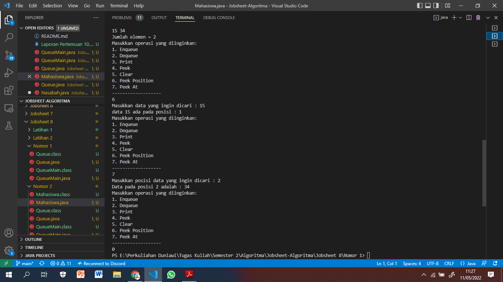
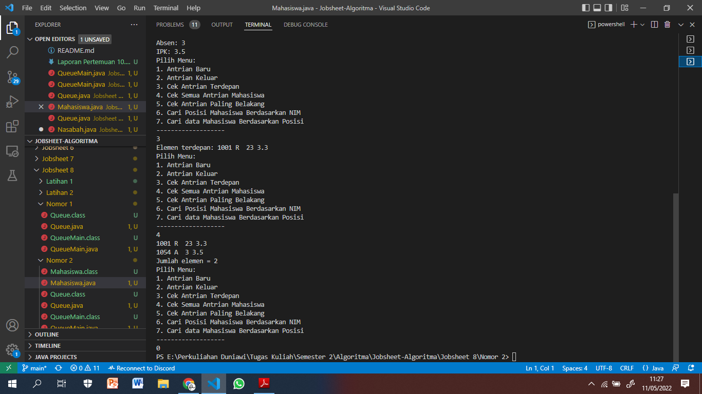

# Laporan Pertemuan 10

>Nama : Roziq Mahbubi
>Kelas : 1G TI
>NIM : 2141720086

### 8.2.3
1. Karena Queue masih kosong sehingga front dan rear tidak boleh bernilai 0 hingga nilai maksimal, sedangkan size hanya menyatakan banyaknya data dalam queue.
2. Kode tersebut berguna jika rear berada pada indeks akhir ketika terjadi proses enqueue, maka posisi rear selanjutnya akan berada di posisi indeks ke 0.
3. Kode tersebut berguna untuk memindahkan posisi front baru pada indeks 0 jika front sebelumnya berada pada indeks akhir sebelum di dequeue.
4. Karena urutan queue berawal dari posisi front, dan posisi front tidak selalu berada pada indeks 0.
5. Kode tersebut digunakan untuk menambahkan nilai i yang akan mengulang dari 0 jika melewati indeks akhir, karena queue dapat menambahkan data baru pada indeks awal jika rear berada pada posisi indeks terkahir.
6. 
```java
if (IsFull()) {
    System.out.println("Queue sudah penuh");
}
```
7. 

### 8.3.3
1. Sistem akan melakukan print data yang didequeue jika semua data pada posisi front tidak kosong.
2. 

### Tugas

